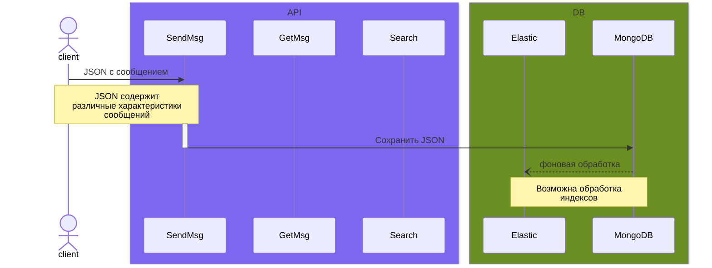
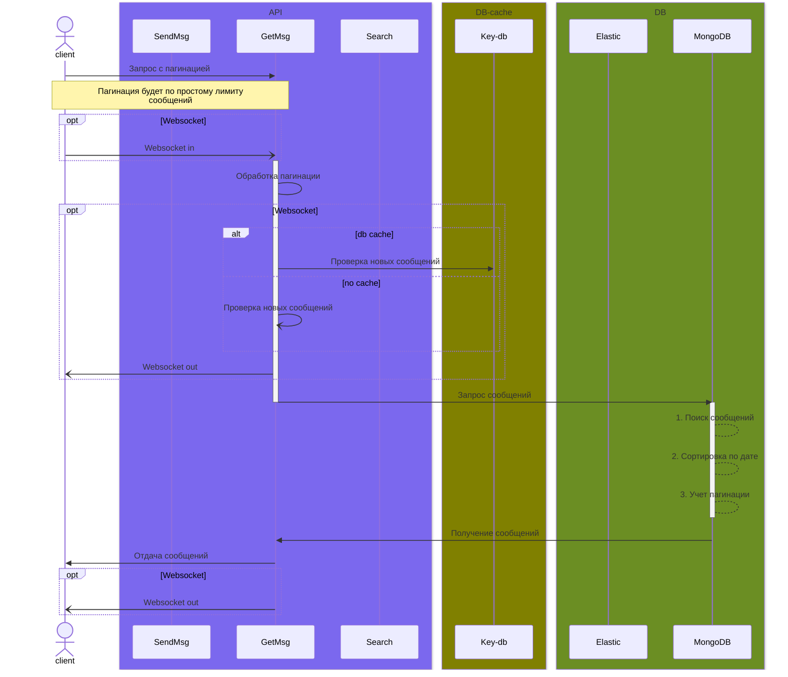
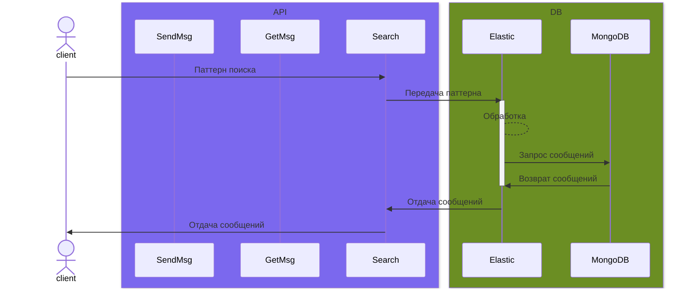

# Чат с тектом
## Авторы:
- Волков Матвей (М8О-109М)
- Федоров Антон (М8О-114М)

## Полезные ссылки


- [Особенности MongoDB](https://mcs.mail.ru/blog/osobennosti-mongodb-kogda-baza-dannyh-vam-podhodit#)
- [MongoDB github actions](https://github.com/marketplace/actions/mongodb-in-github-actions)


- [Key-db](https://docs.keydb.dev/) - fork redis базы данных
- [Key-db](https://habr.com/ru/companies/flant/articles/478404/) - habr статья сравнения с redis


- [ElasticSearch doc](https://www.elastic.co/guide/en/elasticsearch/reference/current/index.html)
- [ElasticSearch habr](https://habr.com/ru/articles/489924/) - "С чего начинается Elasticsearch"

# Документация
## Диаграмма взаимодействий

### Отправка сообщений


При отправке сообщений, пользователь отправляет JSON файл, который содержит все нужные характеристики сообщения такие, как:
- UUID сообщения
- Само сообщение
- Файл в бинарном представлении
- ID чата
- UUID отправителя
- Timestamp время

JSON сообщения сохраняется напрямую в `MongoDB` и `Elasticsearch` используется для сохранения индексов сообщений для последующего удобного поиска.

### Получение сообщений


Получение сообщений сообщений будет происходить по API ручке. (Опционально добавление websocket соединения).

Получение сообщений будет происходит с пагинацией на лимит сообщений (*например 30 сообщений*), которые будут отсортированы по дате отправления сообщений: первое сообщение будет последнее отправленное.

При использовании Websocket полезно использовать какой-нибудь кэш, чтобы возможно было смотреть на изменения сообщений.
Если будет использоваться кэш на базе данных, то будет использоваться key-db.

### Поиск сообщений в чате


Поиск сообщений предполагается осуществлять при помощи `ElasticSearch`.
Elastic, после обработки паттерна и нахождения нужных индексов в MongoDB, пойдет в базу данных MongoDB за самими сообщениями.

ElasticSearch в данном случае служит прослойкой для упрощения поиска по базе MongoDB.

Клиент в данном случае будет получать массив сообщений, паттерн который соответствует телу сообщения.


# Как запустить
Выполнить в терминале:
```bash
docker compose up
```
Потом зайти на `http://127.0.0.1:8000/docs` и дергать ручки.